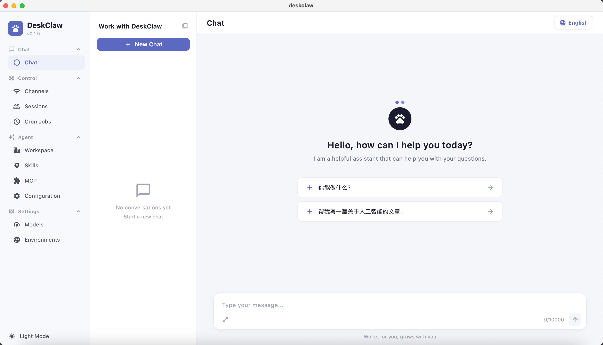

<p align="center">
  <!-- Replace with your app logo/screenshot -->
  <!--  -->
</p>

<h1 align="center">DeskClaw 🦀</h1>

<p align="center">
  <strong>The native desktop GUI for <a href="https://github.com/zeroclaw-labs/zeroclaw">ZeroClaw</a> — fast, small, and fully autonomous AI assistant infrastructure.</strong>
</p>

<p align="center">
  
  
  
  
</p>

<p align="center">
  🌐 <a href="README.md"><b>English</b></a> · <a href="README.zh-CN.md">简体中文</a>
</p>

<p align="center">
  <a href="#getting-started">Getting Started</a> · <a href="#features">Features</a> · <a href="#architecture">Architecture</a>
</p>

---

## Overview

[ZeroClaw](https://github.com/zeroclaw-labs/zeroclaw) is a lean, fully autonomous AI agent runtime written in Rust — zero overhead, provider-agnostic, and deployable anywhere from a $10 microboard to a cloud VM. It ships as a single binary with <5 MB RAM footprint, supporting swappable providers, channels, tools, memory backends, and tunnels.

**DeskClaw** wraps the ZeroClaw runtime in a polished, cross-platform desktop application built with Flutter. The ZeroClaw Rust library is embedded **in-process** via [flutter_rust_bridge](https://github.com/fzyzcjy/flutter_rust_bridge) (FFI) — there is no HTTP server, no subprocess, no daemon to manage. You get the full power of the ZeroClaw agent engine with a native, responsive UI.

> Deploy anywhere. Swap anything. — now with a face.

<!-- Screenshot placeholder — replace the comment below with your actual screenshot -->
<!--  -->

---

## Features

### 💬 Chat
- Streaming AI responses with real-time display
- Markdown rendering (code blocks, lists, bold/italic, etc.)
- Multi-session management — create, rename, and switch between chat sessions
- Auto-titled sessions based on the first message

### 🤖 Models & Providers
- Configure AI providers: **OpenRouter**, **OpenAI**, **Anthropic**, **Ollama**, **OpenAI-compatible endpoints**, and more
- Per-provider API key and base URL management
- Model selection with free-text input for flexible model names
- Adjustable temperature slider

### 📡 Channels
- View and manage all active communication channels
- Enable/disable individual channels

### 🏗️ Workspace & Agent
- Set workspace root path for file-system tools
- Configure agent loop parameters (max iterations, tool call limits)
- Memory configuration
- Cost budgeting and limits

### ⚙️ Configuration
- Autonomy level controls (supervised ↔ autonomous)
- Per-tool permission management (allow / deny / confirm)

### 🌓 Theme
- Light and dark mode with system-follow support
- Clean, modern UI using Google Fonts and Lucide Icons

### Planned / In Progress
- Sessions viewer
- Cron / scheduled tasks
- Skills & custom prompt management
- MCP (Model Context Protocol) server configuration
- Environment variable profiles

---

## Architecture

```
┌─────────────────────────────────────────────────┐
│                Flutter (Dart)                   │
│  Riverpod state · go_router · Material 3 UI    │
│                                                 │
│  Chat  ·  Models  ·  Channels  ·  Workspace    │
│         Configuration  ·  Settings             │
└───────────────────┬─────────────────────────────┘
                    │ flutter_rust_bridge (FFI)
┌───────────────────▼─────────────────────────────┐
│              Rust (rust_lib_deskclaw)           │
│                                                 │
│   agent_api · config_api · workspace_api       │
│                                                 │
└───────────────────┬─────────────────────────────┘
                    │
┌───────────────────▼─────────────────────────────┐
│           ZeroClaw Runtime (Rust crate)         │
│  Providers · Channels · Tools · Memory · Tunnels│
└─────────────────────────────────────────────────┘
```

The Flutter UI communicates with the ZeroClaw Rust runtime through a generated FFI bridge, meaning **all AI logic runs natively in-process** — no HTTP server, no subprocess.

---

## Prerequisites

| Tool | Version |
|------|---------|
| Flutter SDK | ≥ 3.x (`sdk: ^3.9.2`) |
| Rust toolchain | stable (latest recommended) |
| Dart | included with Flutter |

For platform-specific build toolchains (Xcode, Android SDK, etc.) see the [Flutter install docs](https://docs.flutter.dev/get-started/install).

---

## Getting Started

### 1. Clone the repository

```bash
git clone https://github.com/your-org/deskclaw.git
cd deskclaw
```

### 2. Install Flutter dependencies

```bash
flutter pub get
```

### 3. Build the Rust bridge code (if needed)

```bash
flutter_rust_bridge_codegen generate
```

### 4. Configure ZeroClaw

DeskClaw reads the ZeroClaw config from `~/.zeroclaw/config.toml` at startup. Create the file if it does not exist:

```toml
# ~/.zeroclaw/config.toml
provider  = "openrouter"
model     = "anthropic/claude-sonnet-4-20250514"
api_key   = "sk-or-..."
temperature = 0.7
max_tool_iterations = 10
```

You can also configure everything from within the app's **Models** settings page.

### 5. Run the app

```bash
# macOS
flutter run -d macos

# Linux
flutter run -d linux

# Windows
flutter run -d windows

```

---

## Screenshots



---

## Project Structure

```
lib/
├── main.dart              # App entry point, ZeroClaw runtime init
├── constants.dart         # App-wide constants
├── models/                # Freezed data models (ChatMessage, ChatSession…)
├── providers/             # Riverpod providers (chat, sessions, theme…)
├── theme/                 # Light / dark AppTheme
├── views/
│   ├── shell/             # Root layout shell (sidebar + panels)
│   ├── sidebar/           # Icon navigation sidebar
│   ├── chat/              # Chat list, chat view, input bar, message bubble
│   └── settings/          # Models, Channels, Workspace, Configuration pages
rust/
└── src/
    └── api/               # flutter_rust_bridge API definitions
zeroclaw/                  # ZeroClaw Rust crate (git submodule / local path dep)
```

---

## Contributing

Contributions are welcome! Please open an issue or pull request.

1. Fork the repository
2. Create a feature branch: `git checkout -b feat/my-feature`
3. Commit your changes: `git commit -m "feat: add my feature"`
4. Push and open a PR

---

## License

This project is licensed under the **GNU Affero General Public License v3.0 (AGPL-3.0)** — see [LICENSE](LICENSE) for details.

The bundled [ZeroClaw](zeroclaw/) runtime is dual-licensed MIT / Apache-2.0.
